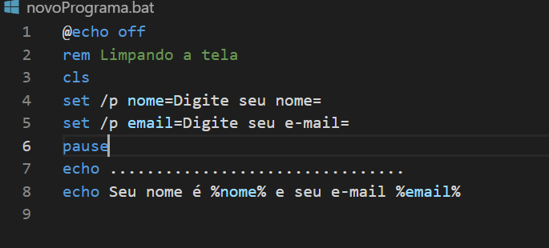

## Arquivo novoPrograma

 Foi criado para coletar no prompt do windows o nome e o e-mail de usuário, novos comandos aprendidos foram: 

<ul>
  <li> pause </li>
  <li> cls </li>
</ul>

 o 'cls' é um comando usado para limpar o prompt de comando e o pause como o próprio nome disse, pausa a execução 

